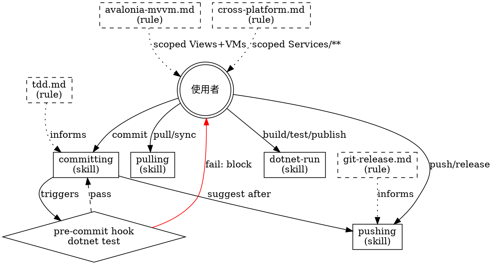

# Agent System Component Plan — MoldplanDbSwitcher
**日期：** 2026-05-07
**rcc 版本：** 11.2.0
**分析報告：** `.rcc/2026-05-07-analysis.md`

---

## Architecture Flowchart



## Pattern Mapping

| 工作流 | Anthropic Pattern |
|--------|-------------------|
| git commit | Prompt chaining |
| git push | Prompt chaining |
| git pull | Prompt chaining |
| dotnet commands | Single LLM call |

## Dependency Graph

```
Phase 0 (無依賴，先執行)
  C1: 清理 settings.local.json

Phase 1 (Phase 0 完成後)
  C2: pre-commit hook     [無內部依賴]
  C3: cross-platform.md  [無內部依賴，可與 C2 並行]
```

---

## Component Plan

### Phase 0 — Core（先執行）

#### C1: 清理 settings.local.json
- **動作：** update
- **檔案：** `.claude/settings.local.json`
- **內容：** 移除以下類別的 allow 規則：
  - 一次性偵錯指令（`find ... grep SERVER`、`ls .claude/rules/...` 等）
  - 跨專案路徑（`waydosoft.moldplan.backend`、openpyxl 相關）
  - 保留：`dotnet build/test/run/publish/restore`、`git add/commit/push/rm/remote`、MCP tool calls
- **原因：** W2/W3：安全風險，跨專案條目不應存在此 settings
- **Writing Skill：** 直接編輯（非 writing-hooks/rules 工作）
- **分類：** core

---

### Phase 1 — Core（可並行）

#### C2: pre-commit hook
- **動作：** new
- **檔案：** `.claude/settings.json` hooks 區塊
- **內容：** `PreToolUse:Bash(git commit:*)` 觸發 `dotnet test`，失敗時阻止 commit
- **原因：** W1：TDD Law 2 需要強制執行，不能靠自律
- **Writing Skill：** `rcc:writing-hooks`
- **分類：** core

#### C3: cross-platform.md globs 更新
- **動作：** update
- **檔案：** `.claude/rules/cross-platform.md`
- **內容：** globs 從 `["src/MoldplanDbSwitcher/Services/**"]` 擴展至 `["src/MoldplanDbSwitcher/**"]`
- **原因：** I1：跨平台路徑在 Models/、ViewModels/ 同樣需要覆蓋
- **Writing Skill：** 直接編輯
- **分類：** core

---

### Phase 2 — Enhancement（未來視需求）

#### E1: feature-developer agent（未規劃）
- **動作：** new（未來）
- **原因：** I2：複雜功能開發時需要 orchestrator-subagents pattern
- **分類：** enhancement，不在本次範圍

---

## Safety Baseline

| Rule | 決定 |
|------|------|
| git-safety.md | `committing.md` skill 已涵蓋，豁免專案層規則 |
| deploy-safety.md | Claude 不直接部署，豁免 |
| destructive-ops.md | INFO：建議未來加入全域規則，超出本次範圍 |

---

## Execution Order

1. C1（直接編輯 settings.local.json）
2. C2（writing-hooks）‖ C3（直接編輯 cross-platform.md）

**預估工作量：** 小（全部為更新/新增單一設定，無複雜邏輯）
